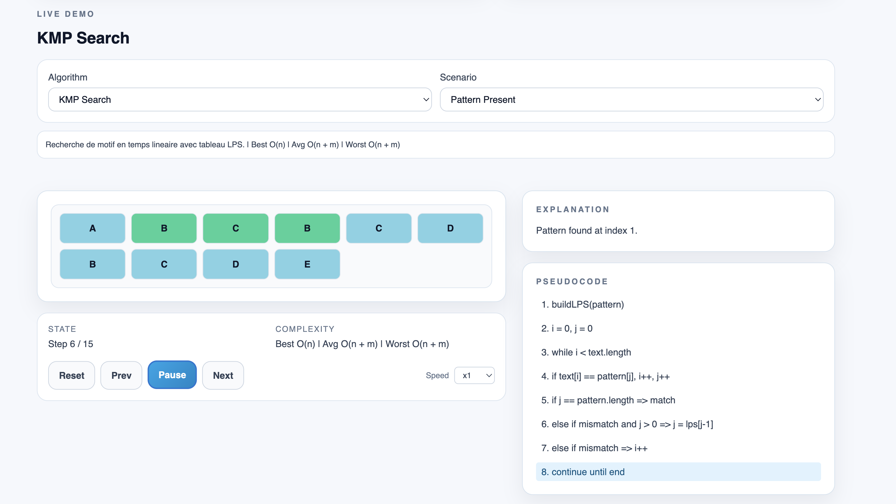

<div align="center">

# AlgoVis Pro

### Interactive Algorithm & Data Structure Visualization Platform

<br />

[](https://www.oracle.com/java/)
[](https://spring.io/projects/spring-boot)
[](https://react.dev/)
[](https://www.typescriptlang.org/)
[](https://vitejs.dev/)
[](https://github.com/features/actions)

<br />

[](#-testing)
[](#-testing)
[](#-demo--presentation)

<br />

A full-stack educational web application for visualizing algorithms step by step,<br />
with synchronized pseudocode, animated state transitions, and guided explanations.<br />
Designed for clear teaching demos and professional academic presentation.

<br />

[Quick Start](#-quick-start) &nbsp;&middot;&nbsp; [API](#-api-reference) &nbsp;&middot;&nbsp; [Architecture](#-architecture) &nbsp;&middot;&nbsp; [Testing](#-testing)

</div>

---

## 📸 Screenshot



---

## ✨ Key Features

- 🎮 Step-by-step player with `Play`, `Pause`, `Next`, `Prev`, `Reset`, and speed control.
- 🧩 Unified execution model (`ExecutionStep`) shared across algorithm families.
- 🧠 Synchronized pseudocode highlighting for every step.
- 📝 Contextual explanation panel for each operation.
- 🎨 Clean, presentation-ready UI (light theme, minimal and professional).
- 🔌 Backend-driven catalog and scenario presets with frontend fallback support.

### 📚 Supported Algorithms

- 🔢 Sorting: Bubble Sort, Merge Sort, Quick Sort
- 🔍 Text Search: KMP
- 🌳 Graph/Tree Traversal: BFS, DFS

---

## 🏗️ Architecture

```text
Browser (React + TypeScript)
        |
        | HTTP / JSON
        v
Spring Boot REST API
  - /api/health
  - /api/algorithms
  - /api/algorithms/{id}/scenarios
```

### 🖥️ Backend Modules

- `controller/` REST endpoints
- `service/` algorithm catalog + scenarios
- `dto/` API contracts
- `config/` CORS and web configuration

### 🌐 Frontend Modules

- `app/` page composition and orchestration
- `features/algorithms/` algorithm run builders
- `components/player/` universal step player
- `components/visualizer/` `bars` and `cells` visualization modes
- `services/` API client layer

---

## 🧰 Tech Stack

| Layer | Technologies |
|---|---|
| Backend | Java 21, Spring Boot 3.5 |
| Frontend | React 18, TypeScript 5, Vite 5 |
| UI | Tailwind CSS |
| Testing | Vitest (frontend), JUnit + MockMvc (backend) |
| CI | GitHub Actions |

---

## 🚀 Quick Start

### ✅ Prerequisites

- Java 21+
- Maven 3.9+
- Node.js 20+
- npm 10+

### 1) Run Backend

```bash
cd backend
mvn -B test
mvn spring-boot:run
```

Default backend URL: `http://localhost:8080`

If port is already used:

```bash
mvn spring-boot:run -Dspring-boot.run.arguments=--server.port=8090
```

### 2) Run Frontend

```bash
cd frontend
npm install
npm run lint
npm run test
npm run build
npm run dev
```

Default frontend URL: `http://localhost:5173`

If backend is on a custom port (example `8090`):

```bash
VITE_API_BASE_URL=http://localhost:8090 npm run dev
```

---

## 📡 API Reference

| Method | Endpoint | Description |
|---|---|---|
| `GET` | `/api/health` | Health status |
| `GET` | `/api/algorithms` | List supported algorithms |
| `GET` | `/api/algorithms/{algorithmId}/scenarios` | List scenarios for an algorithm |

Example:

```bash
curl http://localhost:8080/api/algorithms
```

---

## 🧪 Testing

### Frontend

```bash
cd frontend
npm run test
```

Current suite: **6 tests passed** (algorithm builders)

### Backend

```bash
cd backend
mvn -B test
```

Current suite: **4 tests passed** (context + API endpoints)

---

## ⚙️ CI Pipeline

GitHub Actions workflow: `.github/workflows/ci.yml`

- Frontend: `npm ci` -> `npm run lint` -> `npm run test` -> `npm run build`
- Backend: `mvn -B test`

---

## 🎤 Demo & Presentation

Presentation assets are available in `docs/`:

- `PRESENTATION_GUIDE.md`
- `DEMO_CHECKLIST.md`
- `ROADMAP.md`
- `ARCHITECTURE.md`

---

## ✅ Project Status

Completed phases: **8/8**

- MVP definition and scope
- UI architecture and modularization
- Quality setup (lint, tests, CI)
- Universal step player
- API integration and multi-algorithm expansion
- KMP + BFS/DFS integration
- Test hardening
- Presentation packaging
