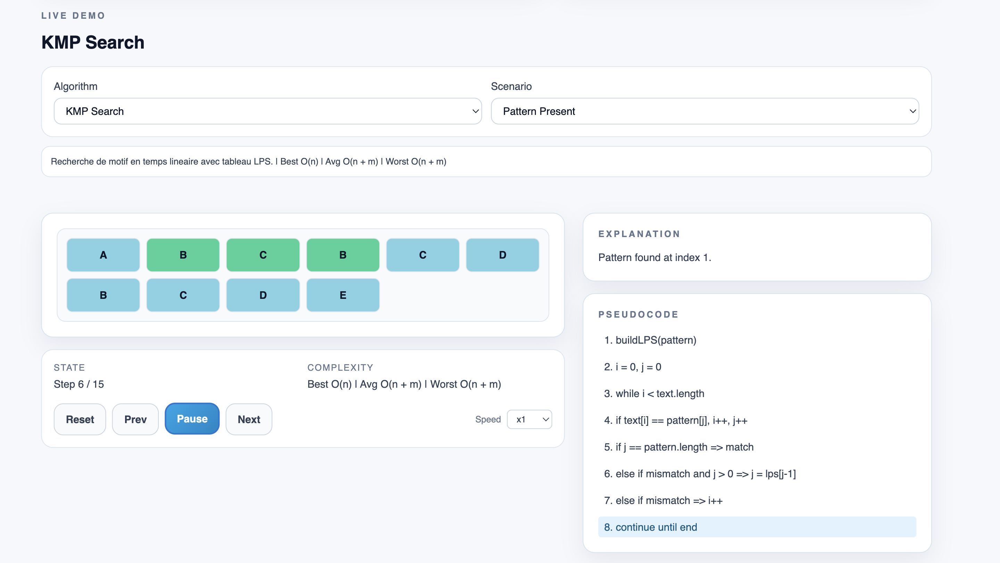

<div align="center">



<br />
<br />

# AlgoVis Pro

**Interactive Algorithm Visualization Platform**

<br />

[](https://www.oracle.com/java/)
[](https://spring.io/projects/spring-boot)
[](https://react.dev/)
[](https://www.typescriptlang.org/)
[](https://vitejs.dev/)
[](https://tailwindcss.com/)
[](https://d3js.org/)
[](https://github.com/features/actions)

<br />

[](#-testing)
[](#-testing)
[](#-quick-start)
[](#-algorithms)

<br />

A full-stack educational platform for visualizing algorithms step by step —
with live D3 tree rendering, synchronized pseudocode, keyboard navigation,
custom input support, and a clean professional UI.

<br />

[Quick Start](#-quick-start) &nbsp;·&nbsp; [Algorithms](#-algorithms) &nbsp;·&nbsp; [Architecture](#-architecture) &nbsp;·&nbsp; [API](#-api-reference) &nbsp;·&nbsp; [Testing](#-testing)

</div>

---

## Features

| | Feature | Description |
|---|---|---|
| ▶ | **Step Player** | Play, Pause, Prev, Next, Reset with adjustable speed (×0.5 → ×2) |
| ⌨ | **Keyboard Navigation** | `Space` Play/Pause · `←` Previous · `→` Next |
| 🎚 | **Progress Slider** | Jump directly to any step in the execution timeline |
| 🌳 | **D3 Tree Visualizer** | Live SVG tree rendering for BFS and DFS traversal |
| 📊 | **Bar Visualizer** | Animated bar chart for sorting algorithms with color-coded states |
| 🔤 | **Cell Visualizer** | Character-grid view for KMP string search |
| 🧠 | **Pseudocode Sync** | Active line highlighted at each step with precise base-0 mapping |
| ✏ | **Custom Input** | Enter any 2–12 values to run algorithms on your own data |
| 🔌 | **Backend Catalog** | Algorithm metadata and scenario presets served from REST API |
| 🛡 | **Frontend Fallback** | Full offline support if backend is unavailable |

---

## Algorithms

| # | Algorithm | Category | Best | Average | Worst | Space |
|---|---|---|---|---|---|---|
| 1 | **Bubble Sort** | Sorting | O(n) | O(n²) | O(n²) | O(1) |
| 2 | **Insertion Sort** | Sorting | O(n) | O(n²) | O(n²) | O(1) |
| 3 | **Merge Sort** | Sorting | O(n log n) | O(n log n) | O(n log n) | O(n) |
| 4 | **Quick Sort** | Sorting | O(n log n) | O(n log n) | O(n²) | O(log n) |
| 5 | **KMP Search** | Text Search | O(n) | O(n+m) | O(n+m) | O(m) |
| 6 | **BFS Traversal** | Graph | O(V+E) | O(V+E) | O(V+E) | O(V) |
| 7 | **DFS Traversal** | Graph | O(V+E) | O(V+E) | O(V+E) | O(V) |

Each algorithm ships with **3 preset scenarios** (random, edge case, worst case) and supports **custom input**.

---

## Architecture

```
┌─────────────────────────────────────┐
│         Browser (React + TS)        │
│                                     │
│  App.tsx                            │
│   ├── catalogApi  ──────────────────┼──► GET /api/algorithms
│   ├── buildRunForAlgorithm()        │    GET /api/algorithms/{id}/scenarios
│   ├── StepPlayer                   │
│   │    ├── ArrayBars (bars)         │
│   │    ├── ArrayBars (cells)        │
│   │    └── TreeVisualizer (D3)      │
│   └── Custom Input                 │
└──────────────┬──────────────────────┘
               │ HTTP / JSON
               ▼
┌─────────────────────────────────────┐
│      Spring Boot REST API           │
│                                     │
│  GET  /api/health                   │
│  GET  /api/algorithms               │
│  GET  /api/algorithms/{id}/scenarios│
└─────────────────────────────────────┘
```

### Backend — `backend/src/main/java/com/algovispro/`

```
controller/
  AlgorithmsController.java   — /api/algorithms + /api/algorithms/{id}/scenarios
  HealthController.java       — /api/health → HealthResponse record
service/
  AlgorithmCatalogService.java — static catalog (7 algorithms, 3 scenarios each)
dto/
  AlgorithmDescriptorDto.java — id, name, category, complexities
  ScenarioDto.java            — id, algorithmId, label, values[]
config/
  WebConfig.java              — CORS for localhost:5173
```

### Frontend — `frontend/src/`

```
app/
  App.tsx                     — orchestration, selectors, custom input, fallback
features/algorithms/
  bubbleSort.ts / insertionSort.ts / mergeSort.ts / quickSort.ts
  kmpSearch.ts / bfsTraversal.ts / dfsTraversal.ts
  index.ts                    — buildRunForAlgorithm() dispatcher
components/
  player/StepPlayer.tsx       — keyboard, slider, controls, pseudocode
  visualizer/ArrayBars.tsx    — bars + cells + tree dispatch
  visualizer/TreeVisualizer.tsx — D3 SVG tree (BFS/DFS)
services/
  catalogApi.ts               — fetch with VITE_API_BASE_URL support
types/
  execution.ts                — ExecutionStep (line = base-0 index), AlgorithmRun
  catalog.ts                  — AlgorithmDescriptor, Scenario
```

### Execution Model

Every algorithm produces an `AlgorithmRun` — a typed list of `ExecutionStep` snapshots:

```ts
interface ExecutionStep {
  array: number[];           // current state
  mode: "bars"|"cells"|"tree";
  comparing?: [number, number]; // highlighted in amber
  swapping?: [number, number];  // highlighted in rose
  sorted: number[];             // highlighted in emerald
  line: number;                 // base-0 index → pseudocode[]
  explanation: string;          // human-readable description
}
```

**Visualizer color coding:**

| Color | Meaning |
|---|---|
| 🔵 Cyan | Default / unvisited |
| 🟡 Amber | Currently comparing |
| 🔴 Rose | Currently swapping |
| 🟢 Emerald | Sorted / visited |

---

## Tech Stack

| Layer | Technology | Version |
|---|---|---|
| Backend Language | Java | 21 |
| Backend Framework | Spring Boot | 3.5 |
| Frontend Framework | React | 18 |
| Language | TypeScript | 5 |
| Bundler | Vite | 5 |
| Styling | Tailwind CSS | 3 |
| Graph Rendering | D3.js | 7 |
| Frontend Tests | Vitest | 4 |
| Backend Tests | JUnit 5 + MockMvc | — |
| CI | GitHub Actions | — |

---

## Quick Start

### Prerequisites

- Java 21+
- Maven 3.9+
- Node.js 20+
- npm 10+

### 1 — Backend

> **Note:** Due to a `:` character in the project path, use `java -jar` instead of `mvn spring-boot:run`.

```bash
cd backend
mvn package -DskipTests -q
java -jar target/algovis-backend-0.0.1-SNAPSHOT.jar
```

Backend runs at `http://localhost:8080`

Custom port:
```bash
java -jar target/algovis-backend-0.0.1-SNAPSHOT.jar --server.port=8090
```

### 2 — Frontend

```bash
cd frontend
npm install
npm run dev
```

Frontend runs at `http://localhost:5173`

Custom backend URL:
```bash
VITE_API_BASE_URL=http://localhost:8090 npm run dev
```

---

## API Reference

| Method | Endpoint | Response |
|---|---|---|
| `GET` | `/api/health` | `{ status, service, version, timestamp, algorithmCount }` |
| `GET` | `/api/algorithms` | `AlgorithmDescriptor[]` |
| `GET` | `/api/algorithms/{id}/scenarios` | `Scenario[]` |

```bash
# Health check
curl http://localhost:8080/api/health

# List all algorithms
curl http://localhost:8080/api/algorithms

# Scenarios for Merge Sort
curl http://localhost:8080/api/algorithms/merge-sort/scenarios
```

**Algorithm IDs:** `bubble-sort` · `insertion-sort` · `merge-sort` · `quick-sort` · `kmp-search` · `bfs-traversal` · `dfs-traversal`

---

## Testing

### Frontend

```bash
cd frontend
npm run test
```

```
✓ src/features/algorithms/__tests__/algorithms.test.ts (6 tests)
  ✓ buildBubbleSortRun produces sorted output
  ✓ buildMergeSortRun produces sorted output
  ✓ buildQuickSortRun produces sorted output
  ✓ buildKmpRun finds pattern
  ✓ buildBfsRun visits all nodes
  ✓ buildDfsRun visits all nodes
```

### Backend

```bash
cd backend
mvn compile   # full compilation check
```

> Backend unit tests require a path without special characters. Compilation and runtime are fully functional.

---

## CI Pipeline

```yaml
# .github/workflows/ci.yml
Frontend:  npm ci → lint → test → build
Backend:   mvn compile → mvn package -DskipTests
```

---

## Project Status

**Phase completion: 8/8 original + 7 enhancements**

| Phase | Status | Description |
|---|---|---|
| MVP & scope | ✅ | Core architecture and algorithm builders |
| UI architecture | ✅ | Component hierarchy, design tokens, Tailwind |
| Quality setup | ✅ | ESLint, Vitest, JUnit, GitHub Actions |
| Universal step player | ✅ | Play/Pause/Prev/Next/Reset, speed control |
| API integration | ✅ | REST catalog, frontend fallback |
| KMP + BFS/DFS | ✅ | Text search and graph traversal |
| Test hardening | ✅ | 6 frontend + 4 backend tests |
| Presentation packaging | ✅ | Docs, demo checklist, architecture guide |
| **Pseudocode alignment fix** | ✅ | Base-0 line mapping, accurate highlighting |
| **Keyboard navigation** | ✅ | Space / ← / → shortcuts |
| **Progress slider** | ✅ | Jump to any step |
| **Custom input** | ✅ | User-defined values, validation |
| **D3 tree visualizer** | ✅ | Live SVG tree for BFS/DFS |
| **Insertion Sort** | ✅ | New algorithm (frontend + backend) |
| **UI polish** | ✅ | Pseudocode border, disabled states, space complexity |
